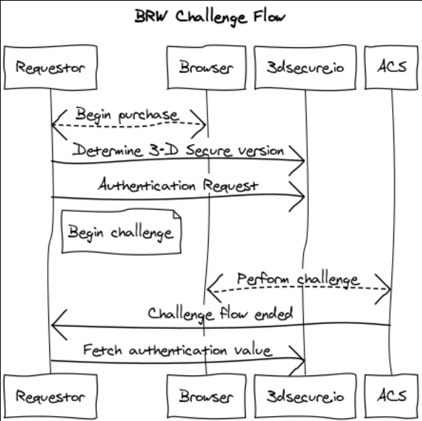
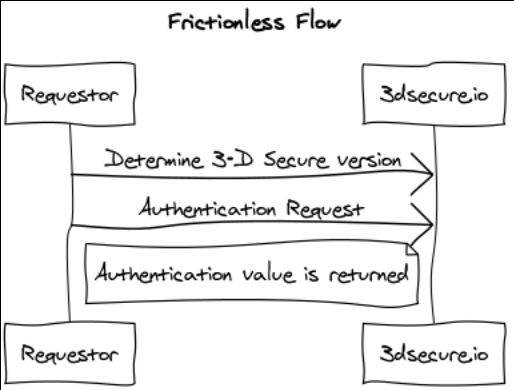

# Clearhaus 3-D Secure Server documentation #

If this is your first time here, please read until the _Getting Started_ Section.

This is the documentation for Clearhaus EMVCo 3-D Secure Server implementation.
Our implementation is a SAAS implementation, offering a language-agnostic HTTP
API integration.

Briefly, a 3-D Secure Server is used in the financial industry, to:
- **Facilitate cardholder _authentication_ in preparation for e.g. making a purchase.**

The specification is developed by EMVCo, best described by [their own
words](https://www.emvco.com/about/overview/):

> EMVCo exists to facilitate worldwide interoperability and acceptance of
> secure payment transactions

The specification is public and can be found at [https://www.emvco.com/emv-technologies/3d-secure/]().
This service supports all active versions of 3-D Secure version 2:

- 2.1.0
- 2.2.0

During integration, you will need to refer to specification for _both_
versions.  The EMVCo 3-D Secure has a different program name for each card
scheme, this service supports the following card schemes:


| Card Scheme     | Program name                                                 |
| --------------- | ------------------------------------------------------------ |
| Mastercard      | Mastercard Identity Check (previously Mastercard SecureCode) |
| Visa            | Visa Secure (previously Verified by Visa)                    |

## Getting Started

1. Sign up at [3dsecure.io](https://www.3dsecure.io), this is out of scope of this document.
2. Read the [getting started](#getting-started) guide for getting an under
   setting up e.g. authentication and to get an overview of the authentication
   flow.
3. Look at the [examples](#examples) in this documentation.
4. ...

### What is an authentication?

An authentication in 3-D Secure is the process of verifying cardholder
involvement in e.g. a purchase. An authentication results from and
_authentication flow_ and proof of authentication is an
_authentication value_.

An _authentication flow_ belongs to one of the following categories:
1. _Challenge_
2. _Frictionless_
3. _Out-of-band (OOB)_
4. _Decoupled Authentication_

#### Challenge flow

A challenge flow is shown in the following diagram:

<div class="img">
  
</div>

#### Frictionless flow

A _frictionless flow_ is shown in the following diagram:

<div class="img">
  
</div>

#### Card Verification flow
```
$ APIKEY=********-****-****-****-************
$ PAN=****************
$ curl -H 'APIKey: $APIKEY' -d "{\"acctNumber\": \"$PAN\"}" https://service.staging.3dsecure.io/preauth
```

## Examples

## Explanation

## Reference

#### Communicating with the server

Access to the service is granted by an API key. A failed authentication looks like:
```
$ curl -iH 'APIKey: 1bde2d3e-7f44-46df-adfd-1db8f3f75783' https://service.sandbox.3dsecure.io/auth
HTTP/2 401
date: Tue, 29 Oct 2019 12:42:06 GMT
content-type: text/plain; charset=utf-8
content-length: 15

Invalid API Key
```

lala
