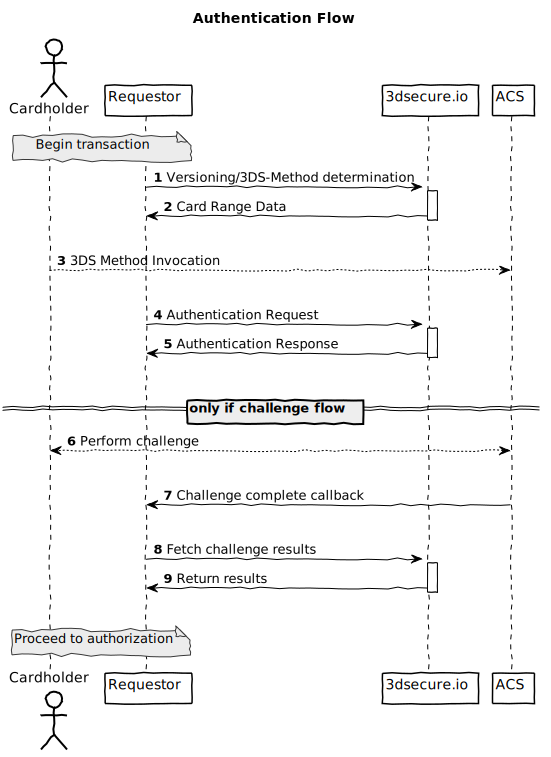

# Clearhaus 3-D Secure Server documentation #

If this is your first time here, please read until the [Read me
first](#read-me-first) Section.

1. Sign up at [3dsecure.io](https://www.3dsecure.io), this is out of scope of this document.
2. Read the [getting started](#getting-started) guide for getting an
   understanding of the authentication flow.
3. Look at the [examples](#examples) in this documentation.
4. Consult the [reference](#reference) to get details about the individual API endpoints.

## Read me first

<!---
{{{
-->

This is the documentation for Clearhaus EMVCo 3-D Secure Server implementation.
Our implementation is a SAAS implementation, offering a language-agnostic HTTP
API integration.
Briefly, a 3-D Secure Server is used in the financial industry, to:
- **Facilitate cardholder _authentication_ in preparation for e.g. making a purchase.**

The specification is developed by EMVCo, best described by [their own
words](https://www.emvco.com/about/overview/):

> EMVCo exists to facilitate worldwide interoperability and acceptance of
> secure payment transactions

The specification is public and can be found at https://www.emvco.com/emv-technologies/3d-secure/.
This service supports all active versions of 3-D Secure version 2:

- 2.1.0
- 2.2.0

During integration, you will need to refer to specification for _both_
versions.  The EMVCo 3-D Secure has a different program name for each card
scheme, this service supports the following card schemes:


| Card Scheme     | Program name                                                 |
| --------------- | ------------------------------------------------------------ |
| Mastercard      | Mastercard Identity Check (previously Mastercard SecureCode) |
| Visa            | Visa Secure (previously Verified by Visa)                    |

<!---
}}}
-->

## Getting Started

### What is an authentication?

An authentication in 3-D Secure is the process of verifying cardholder
involvement in e.g. a purchase. An authentication results from and
_authentication flow_ and proof of authentication is an
_authentication value_.

This figure illustrates the simplified authentication flow from a requestor
point of view:

<div class="img">
  
</div>

An _authentication flow_ is one of the following categories:
* _Frictionless flow_

   This flow includes messages 1-4, where the `authenticationValue`, `eci` and
   `dsTransID` are returned in 4.

* _Challenge flow_

   This includes 1-8, where the `authenticationValue`, `eci` and `dsTransID`
   are returned in 8.

* _Out-of-band (OOB)_

   This includes 1-8, where the `authenticationValue`, `eci` and `dsTransID`
   are returned in 8.

* _Decoupled Authentication_

   This includes 1-4,6-8, where the `authenticationValue`, `eci` and `dsTransID`
   are returned in 8.

### Performing an authentication flow

1. Use the [`/preauth`](#the-preauth-call) call to determine 3-D Secure version.
2. Perform an authentication using the [`/auth`](#the-auth-call) call.
3. If `transStatus` is `C`, perform a [challenge
   flow](#performing-the-challenge) on the cardholder device.
4. Retrieve values from [`/postauth`](#the-postauth-call) endpoint after
   challenge flow has completed.

## Examples

### Frictionless flow example

**Card Verification:**
```
$ APIKEY=********-****-****-****-************
$ PAN=****************
$ curl -H 'APIKey: $APIKEY' -d "{\"acctNumber\": \"$PAN\"}" https://service.staging.3dsecure.io/preauth
```

## Explanation

TODO: Section is currently, envisioned is a sort of FAQ.

## Reference

### Authentication

Access to the service is granted by an API key. The API key is used on each request using the
`APIKey` HTTP header as such:
```
APIKey: <YOUR UUID API KEY>
```

A failed authentication done through _cURL_ looks like:
```
$ curl -iH 'APIKey: 1bde2d3e-7f44-46df-adfd-1db8f3f75783' https://service.3dsecure.io/auth
HTTP/2 401
date: Tue, 29 Oct 2019 12:42:06 GMT
content-type: text/plain; charset=utf-8
content-length: 15

Invalid API Key
```

### The `/preauth` call

Input is a JSON object, with the following parameters:

| Key          | Regexp/Format | Required?  |
| -----        | --------           | ---------- |
| `acctNumber` | `^[1-9]\d{12,18}$` | Yes        |

Example input:
```json
{
  "acctNumber": "4111111111111111"
}
```

POST the body to `/preauth`.

Response:

| Key                       | Regexp/Format  | Required?  |
| -----                     | --------       | ---------- |
| `acsStartProtocolVersion` | messageVersion | Yes        |
| `acsEndProtocolVersion`   | messageVersion | Yes        |
| `threeDSServerTransID`    | UUID           | Yes        |
| `dsStartProtocolVersion`  | messageVersion | No         |
| `dsEndProtocolVersion`    | messageVersion | No         |
| `acsInfoInd`              | ACSInfo        | No         |
| `threeDSMethodURL`        | URL            | No         |


Example response:
```json
{
  "acsStartProtocolVersion": "2.1.0",
  "acsEndProtocolVersion": "2.2.0",
  "threeDSServerTransID": "d461f105-1792-407f-95ff-9a496fd918a9"
}
```

_Note:_ This _must_ be followed up with a [3DS method
invocation](#3ds-method-invocation) if `threeDSMethodURL` is included.

### 3DS Method Invocation

If the `/preauth` call includes a `threeDSMethodURL`, the 3DS Method _must_ be
invoked.

1. Create JSON object containing `threeDSServerTransID` from the `/preauth` call:
   ```json
   {
     "threeDSServerTransID": "d461f105-1792-407f-95ff-9a496fd918a9",
     "threeDSMethodNotificationURL": "<SOME URL>"
   }
   ```
1. _(Requirement 261)_
   Render a hidden HTML iframe in the Cardholder browser and send a form
   with a field name `threeDSMethodData` containing the above JSON to the
   `threeDSMethodURL`.

### The `/auth` call
1. POST a authentication JSON message (`AReq`) to `/auth` endpoint.
2. If `transStatus` is `C`, perform a challenge flow.

### The `/postauth` call
1. Post a JSON object to the `/postauth` endpoint:
  ```json
  {
    "threeDSServerTransID": "d461f105-1792-407f-95ff-9a496fd918a9"
  }
  ```

## Performing the challenge

TODO: Add information about how requestor should perform the challenge.
