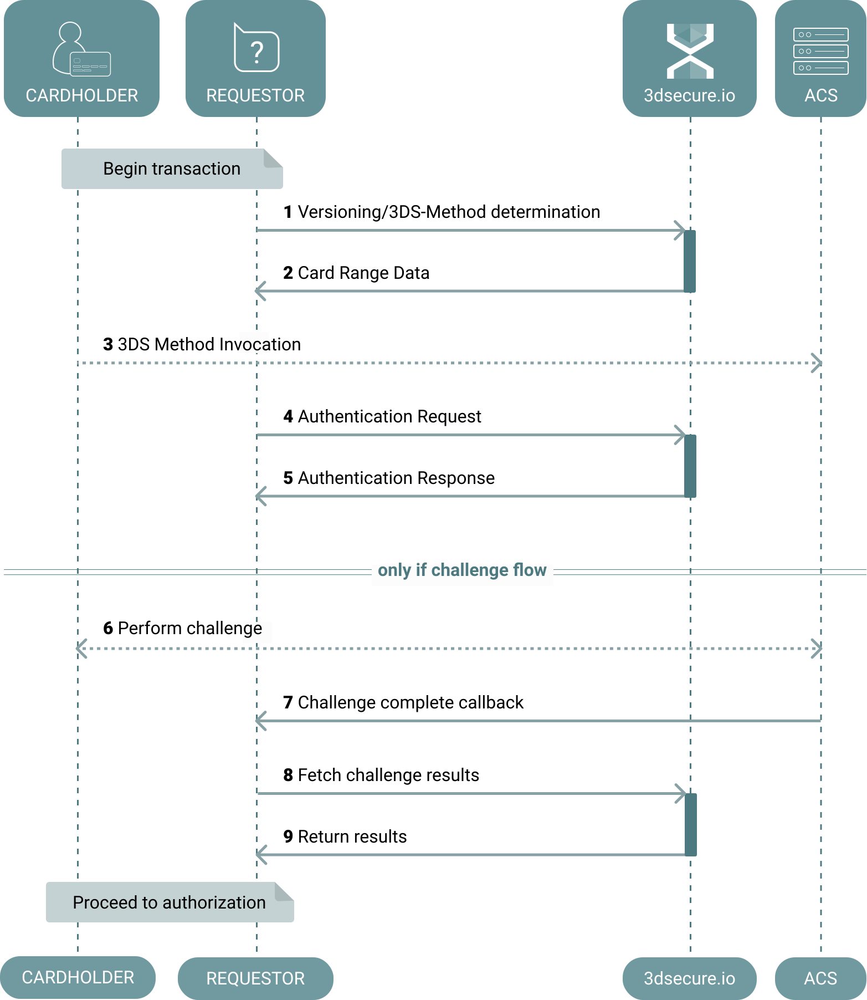

.. _getting-started:

###############
Getting Started
###############

This page is intented to familiarize you with parts of the 3-D Secure v2, and
to provide you with *some* understanding of a 3-D Secure v2 authentication
flow.

Authentication
==============

In 3-D Secure v2, cardholder authentication might not necessarily involve the
cardholder.

An authentication flow not involving the cardholder, is called a *frictionless
flow*, whereas a flow involving the cardholder is called a *challenge flow*.
The *frictionless flow* utilizes device fingerprinting to verify cardholder
authenticity, providing a smoother transaction for the cardholder.

The structure of an authentication transaction can be described broadly by the
two variables below, which are included in every transaction.

Message categories (``messageCategory``)
----------------------------------------

Payment
  Used for the normal payment authentication flow.
  The message value is ``01``.

Non-Payment
  Used for e.g. cardholder account verification.
  The message value is ``02``.

Device channels (``deviceChannel``)
-----------------------------------

APP
  Authentications initiated on a e.g. a mobile phone, utilizing a dedicated
  native 3-D Secure SDK for the specific device.
  The message value is ``01``.

BRW
  Authentications performed using a browser, similar to 3-D Secure version 1.
  The message value is ``02``.

3RI
  Authentications performed without cardholder involvement, used for e.g.
  getting 3-D Secure values for subsequent recurring transactions.
  The message value is ``03``.

URL Endpoints
=============

There are 3 API endpoints for this service, refer to :ref:`reference` for
parameter definition. Brief descriptions are:

/preauth
  This is used when performing transactions from a browser (as opposed to using
  an SDK). It will return an optional 3-D Secure Method URL, which is used for
  browser fingerprinting. This can support risk-based analysis and assist in
  ensuring a frictionless flow where the cardholder is not directly involved.

  While in the transition period between 3-D Secure v1 and v2, this endpoint
  can help determine if v1 should be used instead. This is documented in the
  :ref:`3ds_versioning` guide.

/auth
  The primary API method to provide authentication data to the issuer.  Under
  certain circumstances, the authentication flow will end successfully here,
  this is called a *frictionless* flow.

/postauth
  Used when the ``/auth`` did not result in a frictionless flow, this endpoint
  returns the result of the challenge performed by the cardholder. In this case
  the flow is called a *challenge* flow. Read more about this in
  :ref:`3ds_challenge_flow`.

Overview of Authentication Flow
===============================

This figure illustrates the authentication flow from a requestor
point of view:

The following describes the individual points in the diagram:

1. A call to the :ref:`preauth-usage` is performed if the
   request originator is a cardholder using a browser. This is opposed to using a
   SDK or the authentication being Requestor initiated.
2. The ``/preauth`` response (ref. :ref:`2.1.0 <preauth-response-210>`,
   :ref:`2.2.0 <preauth-response-220>`,
   :ref:`2.3.1.1 <preauth-response-2311>`) contains:

   - Information that might be usable in determining whether to fall back to
     3-D Secure v1.
   - An optional ``threeDSMethodURL`` that is invoked in the user browser.

3. The cardholder browser invokes the received ``threeDSMethodURL``, to allow the ACS to
   fingerprint the browser. See the :ref:`3ds_method` guide.
4. The Requestor uses the :ref:`auth-usage` to send the information needed for
   the 3-D Secure Server. The Server assembles a ``AReq`` message and transmits
   it to the Directory Server.
5. The Authentication response (ref. :ref:`2.1.0 <auth-response-210>`,
   :ref:`2.2.0 <auth-response-220>`, :ref:`2.3.1.1 <auth-response-2311>`) is an ``ARes``, as defined by the
   specification.

   This ``ARes`` contains either:

   - The authentication result (*frictionless* flow)
   - Information about how to proceed with the challenge (*challenge* flow)
   - Information stating why the challenge cannot continue

6. The cardholder completes the challenge on the their device. See the
   :ref:`3ds_challenge_flow` guide.
7. The ACS informs the Requestor about the challenge result through a callback.
8. The :ref:`postauth-usage` is used to fetch the results of the
   authentication.
9. Nominally a ``RReq`` is returned to the Requestor. Parameters are detailed
   in the ``/postauth`` response (ref. :ref:`2.1.0 <postauth-response-210>`,
   :ref:`2.2.0 <postauth-response-220>`, :ref:`2.3.1.1 <postauth-response-2311>`) section.

Sandbox environment
===================

A sandbox environment is included as a service for initial and continuous
integration, and for live tests. This is our own implementation, so
discrepancies with ACS implementations are unavoidable.

.. warning::
  1. *Under no circumstances* may real card numbers or other cardholder
     information be sent to the sandbox.

  2. The production endpoint is to be used only for production requests.
